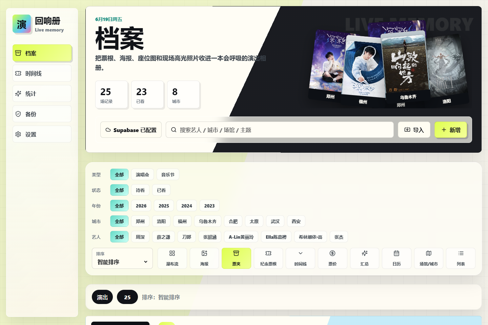

# 回响册 Live Memory

> 把票根、海报、座位图和现场照片，整理成真正愿意反复翻看的演出档案。

[](https://github.com/Qi-i/live-memory/actions/workflows/deploy.yml)
[](https://qi-i.github.io/live-memory/)
[](./LICENSE)



回响册是一款本地优先的个人演出记录 PWA。它不是一张只有标题和日期的清单，而是围绕演出中最值得保存的媒介设计：主海报、电子票根、座位图、现场精选照片，以及多艺人阵容、票价座位和同行记忆。

**在线地址：** <https://qi-i.github.io/live-memory/>

> 当前版本为个人可用的 Beta。共享的是这个 GitHub Pages 测试应用，个人票根、座位图和现场照片不会进入公共库。无 Supabase 时可以完全本地使用；启用 Supabase 后，每个登录用户只同步自己的数据。

## 主要能力

- 11 种浏览方式：瀑布流、海报、票夹、纪念票根、时间线、票价、汇总、日历、场馆/城市、列表等。
- 一场演出可保存多位艺人、主办、嘉宾和完整阵容文本，适用于音乐节与拼盘演出。
- 海报、票根、座位图、现场照片分类管理，支持原比例展示和沉浸式大图查看。
- 类型、状态、年份、城市、艺人多选筛选，配合搜索和多种排序。
- 大麦公开链接、普通文本、多张图片和 JSON 备份批量导入。
- IndexedDB 本地优先保存；断网仍可查看和编辑。
- Supabase Auth、Database、私有 Storage 与 RLS，实现每位用户数据隔离；可用邮箱密码或 Supabase GitHub OAuth 登录。
- JSON 完整备份与 CSV 元数据导出，数据不被平台锁死。
- 响应式桌面/手机布局和可安装 PWA。


## 技术栈

| 模块 | 实现 |
| --- | --- |
| Web 应用 | Vite 7、React 18、TypeScript 5 |
| 本地数据 | IndexedDB，localStorage 降级 |
| 云端同步 | Supabase Auth + Postgres + Storage |
| 权限保护 | Postgres RLS + 私有 Storage bucket |
| 图标 | Lucide React |
| 离线能力 | Service Worker + Web App Manifest |
| 自动发布 | GitHub Actions + GitHub Pages |

## 快速开始

需要 Node.js 20.19 或更高版本，推荐 Node.js 22。

```powershell
git clone https://github.com/Qi-i/live-memory.git
cd live-memory
npm install
npm run dev
```

电脑打开 <http://127.0.0.1:5173/>。同一局域网的手机可以打开终端中显示的 `Network` 地址。

仅允许本机访问时使用：

```powershell
npm run dev:local
```

## 环境变量

复制 `.env.example` 为 `.env.local`，再填写自己的项目参数：

```dotenv
VITE_SUPABASE_URL=https://YOUR_PROJECT.supabase.co
VITE_SUPABASE_ANON_KEY=YOUR_ANON_OR_PUBLISHABLE_KEY
VITE_SUPABASE_MEDIA_BUCKET=echo-media
```

| 变量 | 必需 | 说明 |
| --- | --- | --- |
| `VITE_SUPABASE_URL` | 否 | Supabase Project URL；不填时保持纯本地模式 |
| `VITE_SUPABASE_ANON_KEY` | 否 | 浏览器可用的 anon/publishable key，权限由 RLS 限制 |
| `VITE_SUPABASE_MEDIA_BUCKET` | 否 | 私有图片桶，默认 `echo-media` |

不要把 `service_role` key、数据库密码或其他服务端密钥放进 `VITE_*` 变量。Vite 会把这些变量编译进浏览器代码。

## 配置 Supabase

1. 创建 Supabase 项目。
2. 在 SQL Editor 中完整执行 [`001_echo_archive.sql`](./supabase/migrations/001_echo_archive.sql)。
3. 在 Authentication 中确认邮箱登录策略；如需 GitHub 登录，在 Supabase Auth Provider 中启用 GitHub OAuth。
4. 将 Project URL 与 anon/publishable key 填入 `.env.local`，或直接在应用“设置”页填写。
5. 注册并登录后，先推送本地数据，再在第二台设备使用同一 Supabase 用户登录并拉取。

SQL 会创建：

- `echo_records`：演出记录及完整 JSON payload。
- `echo_media_assets`：图片索引、类型、尺寸与存储路径。
- `echo-media`：默认私有 Storage bucket。
- 以 `auth.uid()` 为边界的数据库与图片 RLS 策略。

逐步截图式说明和故障排查见 [Supabase 配置指南](./docs/supabase-setup.md)。

## 发布到 GitHub Pages

仓库已经包含 [GitHub Actions 工作流](./.github/workflows/deploy.yml)。首次发布只需：

1. 打开仓库 `Settings > Pages`。
2. 将 `Build and deployment > Source` 设为 `GitHub Actions`。
3. 推送到 `main`，等待 `Deploy GitHub Pages` 完成。

Vite 使用相对资源路径，因此既能部署在根域名，也能部署在 `/live-memory/` 这样的仓库子路径。完整发布、回滚和 404 排查见 [部署指南](./docs/deployment.md)。

## 数据和隐私

- GitHub Pages 发布的是同一个前端应用壳，所有人看到的是同一套界面和示例能力，不是同一个共享相册。
- GitHub 只保存源代码、示例资源和文档，不保存你的个人票根与现场照片。
- 浏览器数据默认保存在当前设备 IndexedDB。
- 启用同步后，元数据进入 Supabase Postgres，图片进入私有 Storage；记录都带有当前 Supabase 用户的 `user_id`。
- 图片路径采用 `userId/recordId/mediaId.ext`，RLS 只允许所属用户访问。
- 私有图片通过短期签名 URL 展示；`service_role` key 永远不进入前端。
- 完整 JSON 备份可能包含图片 data URL，属于敏感文件，不应提交到 Git。

### 多人使用时的边界

| 模式 | 谁能看到数据 | 适合场景 |
| --- | --- | --- |
| 本地模式 | 当前浏览器 | 单设备试用、完全离线 |
| 自带 Supabase | Supabase 项目拥有者本人和当前登录用户 | 每个人管理自己的私人档案 |
| 统一托管 Supabase | 普通用户之间互相不可见；项目管理员有后台管理权限 | 小范围测试或未来托管服务 |

如果你不希望任何管理员接触个人数据，请选择“自带 Supabase”模式：每个人连接自己的项目，应用只作为开源前端使用。

更多说明见 [数据与同步](./docs/data-and-sync.md) 和 [存储与发布策略](./docs/storage-and-publishing.md)。

## 常用命令

| 命令 | 用途 |
| --- | --- |
| `npm run dev` | 启动局域网可访问的开发服务器 |
| `npm run dev:local` | 仅在本机启动开发服务器 |
| `npm run typecheck` | 运行 TypeScript 严格类型检查 |
| `npm run build` | 类型检查并生成 `dist/` |
| `npm run check` | 发布前完整构建检查 |
| `npm run preview` | 在 5174 端口预览生产构建 |

## 项目结构

```text
src/
  domain.ts             数据模型、枚举与规范化
  storage.ts            IndexedDB、本地降级与旧数据迁移
  supabase.ts           登录、记录同步与私有图片上传
  storageProviders.ts   R2/COS/OSS/S3 扩展接口
  importers.ts          大麦公开页与文本导入草稿
  media.ts              图片压缩、读取和下载
  App.tsx               页面、视图、详情与编辑流程
  styles.css            统一视觉系统与响应式布局
public/                  PWA 图标、manifest、Service Worker
supabase/migrations/     数据库、Storage 与 RLS 初始化
docs/                    架构、部署、同步和存储文档
```

设计和数据流详见 [实现架构](./docs/architecture.md)。

## 已知边界

- 大麦导入只读取无需登录的公开信息，不处理验证码、抢票、订单或个人购票数据；页面结构变化时可能需要人工校正。
- 当前同步是显式“推送/拉取”，还不是后台实时双向同步；操作前建议先导出备份。
- 高德/百度地图目前保留配置接口，未配置 Key 时展示稳定的城市/场馆统计。
- Supabase 免费额度适合个人精选图片；大量原图建议保留在相册/硬盘，或接入 R2、COS、OSS。

## 参与开发

欢迎提交 Issue 或 Pull Request。开始前请阅读 [CONTRIBUTING.md](./CONTRIBUTING.md)；安全问题请按 [SECURITY.md](./SECURITY.md) 私下报告。

本项目采用 [MIT License](./LICENSE)。
