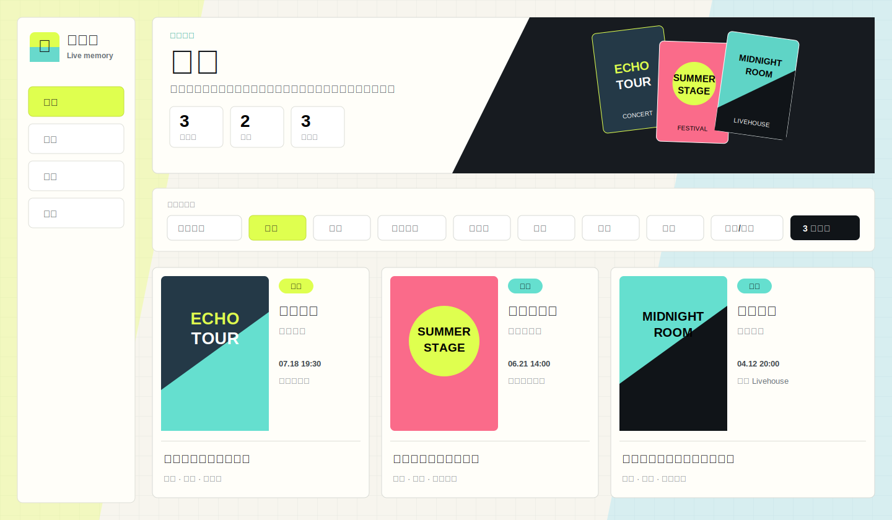
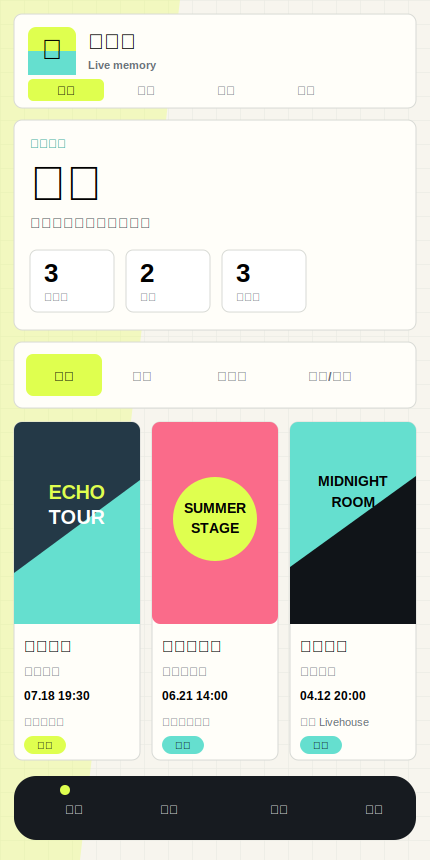

# 回响册 Live Memory

把演出海报、电子票根、座位图、现场照片和观演记忆整理成一册私人档案。

[](https://github.com/Qi-i/live-memory/actions/workflows/deploy.yml)
[](https://qi-i.github.io/live-memory/)
[](./LICENSE)



## 怎么使用

大多数用户直接打开公开地址即可使用，不需要下载文件：

**<https://qi-i.github.io/live-memory/>**

首次进入时登录或创建 Live Memory 账号，并选择一种保存方式。账号会同步昵称、头像、显示偏好、个人 Supabase 连接配置和文字备份；登录密码只用于验证，不会明文保存到资料表。

| 保存方式 | 演出文字 | 图片 | 适用场景 |
| --- | --- | --- | --- |
| 账号文字备份 | 随账号同步 | 留在当前设备 | 图片较多、希望节省云端空间 |
| Supabase 完整同步 | 同步 | 可选择同步 | 电脑和手机查看同一套完整档案 |

公开站点内置 3 条演示记录。每位用户的私人档案保存在自己的浏览器、Live Memory 账号或个人 Supabase 中，不会写入 GitHub 仓库。

| 你想做什么 | 使用方式 |
| --- | --- |
| 只记录自己的演出 | 打开公开地址，在页面中登录并开始使用 |
| 电脑和手机同步文字 | 使用 Live Memory 账号的文字备份 |
| 电脑和手机同步图片 | 在设置页连接自己的 Supabase |
| 修改代码或本地开发 | 克隆仓库并运行 `npm install`、`npm run dev` |
| 发布自己的站点 | Fork 仓库，配置 GitHub Pages 和账号项目 |

当前没有必须下载的 Release 安装包。需要离线保存数据时，请在应用的 `备份` 页面导出 JSON。

## 功能

- 海报、票夹、纪念票根、时间线、票价、汇总、日历、场馆/城市和列表视图。
- 演唱会、音乐节、Livehouse、剧场等类型，支持多艺人和完整阵容。
- 海报、票根、座位图、现场精选照片分类管理与大图查看。
- 类型、状态、年份、城市、艺人、标签多选筛选和多种排序。
- 大麦公开链接、文本、多张图片、JSON 备份批量导入。
- Live Memory 账号资料、显示偏好、个人 Supabase 配置、文字云备份和自动备份。
- 用户自带 Supabase 完整同步；公开站点登录账号后可直接连接，图片上传可独立关闭。
- 删除二次确认、回收站恢复和永久删除确认。
- JSON 完整备份、JSON 文字备份和 CSV 导出。
- 响应式桌面/手机界面与 PWA 安装。



## 本地运行

本地运行适合开发、修改界面或部署自己的版本。需要 Node.js 20.19 以上，推荐 Node.js 22。

```powershell
git clone https://github.com/Qi-i/live-memory.git
cd live-memory
npm install
npm run dev
```

电脑打开 <http://127.0.0.1:5173/>。手机与电脑连接同一 Wi-Fi 后，打开终端显示的 `Network` 地址。

仅允许本机访问：

```powershell
npm run dev:local
```

构建并预览发布版本：

```powershell
npm run check
npm run preview
```

预览地址为 <http://127.0.0.1:5174/>。

## 配置账号服务

只有维护自己的公开站点时才需要这一节。普通用户直接使用公开地址时，不需要配置这些变量。

Live Memory 账号项目用于登录、备用邮箱核对重置密码、账号资料、显示偏好、个人 Supabase 配置和文字备份；用户个人演出档案仍由用户自己的 Supabase 或当前设备保存。复制 `.env.example` 为 `.env.local`：

```dotenv
VITE_ACCOUNT_SUPABASE_URL=https://YOUR_ACCOUNT_PROJECT.supabase.co
VITE_ACCOUNT_SUPABASE_ANON_KEY=YOUR_ACCOUNT_PUBLISHABLE_KEY

VITE_SUPABASE_URL=
VITE_SUPABASE_ANON_KEY=
VITE_SUPABASE_MEDIA_BUCKET=echo-media
```

| 变量 | 用途 |
| --- | --- |
| `VITE_ACCOUNT_SUPABASE_URL` | Live Memory 账号、资料、偏好、备用邮箱重置密码和文字备份 |
| `VITE_ACCOUNT_SUPABASE_ANON_KEY` | 账号项目的公开连接密钥 |
| `VITE_SUPABASE_URL` | 可选的默认个人数据项目；通常由用户在设置页填写 |
| `VITE_SUPABASE_ANON_KEY` | 默认个人数据项目的公开连接密钥 |
| `VITE_SUPABASE_MEDIA_BUCKET` | 图片空间名称，默认 `echo-media` |

浏览器变量只能使用 `anon` 或 `publishable` key。数据库密码、`service_role` 和其他 Secret 不得写入 `.env`、前端代码或 GitHub Variables。

## 初始化 Supabase

普通用户连接自己的个人 Supabase 时，只需要在个人项目的 `SQL Editor` 运行：

- [`005_passkey_cloud_sync.sql`](./supabase/migrations/005_passkey_cloud_sync.sql)

这个文件会建立私人演出记录表、媒体索引、私有图片空间和访问规则。站点维护者自部署 Live Memory 账号项目时，才需要按顺序运行 1-7 号 migration 并配置 GitHub Pages 变量。完整操作见 [Supabase 配置指南](./docs/supabase-setup.md)。

## 把现有记录迁入私人云端

现有 25 条记录只在原来打开它们的浏览器中，不在 GitHub 仓库。按下面顺序迁移：

1. 回到仍能看到 25 条记录的页面，在 `备份` 页导出 `完整 JSON`。
2. 打开公开站点；如果页面只有 3 条示例记录，在 `导入` 中选择刚才导出的 JSON。
3. 导入完成后确认档案页显示 25 条个人记录；3 条示例可以移入回收站。
4. 在 `设置 > 数据保存位置` 选择 `Supabase 完整同步`。
5. 按页面教程创建个人 Supabase，首次填写项目地址和公开连接密钥；保存后会随 Live Memory 账号恢复到其他设备。
6. 如果页面显示已登录账号，直接点击 `连接个人云端`；没有账号服务的自部署版本会要求设置档案密码。
7. 决定是否开启 `同步图片`，再点击 `上传到我的云端`。
8. 在 Supabase `Table Editor > echo_passkey_records` 确认有 25 条记录；开启图片同步时，再到 `Storage > echo-media` 检查图片目录。

导入公开站点只会把数据写入当前浏览器。完成第 7 步后，记录才会进入你自己的私人 Supabase；它们不会进入 GitHub 页面或仓库。

## 发布到 GitHub Pages

仓库包含 [部署工作流](./.github/workflows/deploy.yml)。

1. 打开 GitHub 仓库 `Settings > Pages`。
2. 将 `Build and deployment > Source` 设为 `GitHub Actions`。
3. 在 `Settings > Secrets and variables > Actions > Variables` 添加 `VITE_ACCOUNT_SUPABASE_URL` 和 `VITE_ACCOUNT_SUPABASE_ANON_KEY`。工作流也兼容旧变量名 `VITE_SUPABASE_URL` 和 `VITE_SUPABASE_ANON_KEY`。
4. 推送到 `main`，等待 `Deploy GitHub Pages` 完成。

更多发布、缓存和 404 排查见 [部署指南](./docs/deployment.md)。

## 数据边界

- 源代码、图标、文档和 3 条演示记录进入 GitHub。
- 演出记录先写入浏览器 IndexedDB。
- 账号资料、显示偏好和个人 Supabase 公开连接配置写入账号项目的 `echo_user_profiles`。
- 文字备份写入账号项目的 `echo_text_backups`。
- 完整同步写入用户个人项目的 `echo_passkey_records` 和 `echo_passkey_media_assets`。
- 图片仅在开启图片同步后进入私有 `echo-media` 空间。
- 回收站使用 `deletedAt` 和云端 `deleted_at` 保留可恢复删除状态。
- 账号表按当前用户 ID 限制访问，个人完整档案按同步钥匙限制访问。

完整 JSON 可能包含票根、二维码、订单信息和现场照片，请保存在私人设备或可信存储中。

## 项目结构

```text
src/
  domain.ts             数据模型、输入规则与默认设置
  storage.ts            IndexedDB、降级存储和旧数据迁移
  supabase.ts           账号、文字备份、个人云端同步和图片上传
  syncModel.ts          文字备份裁剪与本地图片合并规则
  media.ts              图片压缩、头像处理和下载
  importers.ts          公开链接与文本导入
  storageProviders.ts   对象存储适配接口
  App.tsx               页面、视图、详情、回收站和设置流程
  styles.css            设计系统与响应式布局
public/                  PWA 图标、manifest、Service Worker
supabase/migrations/     数据表、图片空间和访问规则
docs/                    使用、架构、同步和部署文档
```

## 文档

- [Supabase 配置指南](./docs/supabase-setup.md)
- [数据与同步](./docs/data-and-sync.md)
- [实现架构](./docs/architecture.md)
- [存储与发布策略](./docs/storage-and-publishing.md)
- [部署指南](./docs/deployment.md)
- [安全策略](./SECURITY.md)
- [参与开发](./CONTRIBUTING.md)
- [更新记录](./CHANGELOG.md)

## 技术栈

Vite 7、React 18、TypeScript 5、IndexedDB、Supabase、Lucide React、Service Worker、GitHub Actions 和 GitHub Pages。

本项目采用 [MIT License](./LICENSE)。
