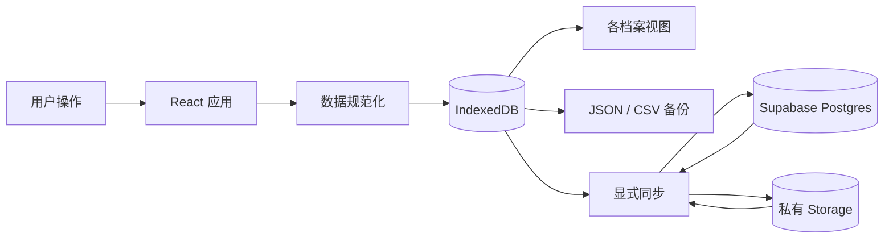

# 实现架构

本文说明回响册当前真实的数据流、模块边界和扩展方式，方便复现、审查和继续开发。

## 设计原则

1. **本地优先**：新增和编辑先写当前浏览器，不因云端不可用阻塞核心操作。
2. **图片优先**：海报、票根、座位图和现场照片是独立媒体资产，不只是一个封面 URL。
3. **数据可带走**：JSON 是完整备份出口，CSV 是便于分析的元数据出口。
4. **前端不持有服务端密钥**：浏览器只使用 anon/publishable key，授权交给 RLS。
5. **展示层可替换**：Web、小程序或未来桌面端复用同一份领域模型和云端 schema。

## 运行时数据流

应用启动时先读取 `echo-archive-v2`。如果当前库为空且尚未迁移，会读取旧 IndexedDB `echo-archive-local/events`，再尝试旧 localStorage 数据；两者都没有时才载入示例档案。

## 核心模型

`EventRecord` 是演出聚合根，包含：

- 标题、类型、状态、日期和时间。
- 城市、场馆、地址与坐标预留。
- 多艺人 `artists` 与带角色的 `lineup`。
- 实付票价、公开票价区间、座位、同行人、标签、曲目和备注。
- 来源渠道、来源链接和导入置信度。
- 多个 `MediaAsset`。

`MediaAsset.kind` 区分 `poster`、`ticket`、`seatMap`、`livePhoto` 和其他附件。它同时保存宽高、MIME、大小、来源和云端路径，使展示层可以按真实比例布局。

## 模块职责

| 文件 | 职责 |
| --- | --- |
| `src/domain.ts` | 领域类型、默认设置、日期与规范化工具 |
| `src/storage.ts` | IndexedDB CRUD、localStorage 降级、旧版迁移 |
| `src/media.ts` | 浏览器图片压缩、data URL/Blob 转换与下载 |
| `src/importers.ts` | 公开链接和文本解析，输出可编辑 `ImportDraft` |
| `src/supabase.ts` | Auth、记录 upsert、图片上传、签名 URL |
| `src/storageProviders.ts` | 对象存储抽象与后续供应商扩展点 |
| `src/App.tsx` | 路由状态、筛选、各视图、详情、编辑和设置 |
| `src/styles.css` | 设计 token、组件状态和响应式规则 |

## 同步语义

当前版本采用用户触发的单向操作：

- **推送到云端**：逐条上传尚未进入 Storage 的本地 data URL，再 upsert 记录和媒体索引。
- **从云端拉取**：读取当前用户未删除的记录，为私有图片重新生成签名 URL，并替换本地集合。

这是明确、可预测的 Beta 方案，但并非自动冲突合并。后续实时同步应增加版本号、设备 ID、删除墓碑、同步队列和字段级冲突界面。

## 对象存储扩展

`MediaStorageProvider` 约定 `upload`、`signedUrl` 与 `remove`。接入 Cloudflare R2、腾讯云 COS、阿里云 OSS 或 S3 兼容服务时，推荐由可信服务端签发短期上传凭证，不要把 Secret Key 放进浏览器。

## PWA 与更新

Service Worker 对页面导航采用 network-first，优先获得新版 HTML；对同源静态资源采用 stale-while-revalidate；离线时回退到缓存的应用壳。每次改变缓存策略时应提升 `CACHE_NAME`。

## 后续发布级增强

- 将 `App.tsx` 继续拆分为 `views/`、`components/` 和 `features/`。
- 增加 Vitest 单元测试与 Playwright 关键流程测试。
- 增加媒体哈希去重、缩略图与可恢复上传队列。
- 增加增量同步、冲突解决和软删除同步。
- 实装高德/百度适配器，并确保 Key、域名白名单和隐私提示正确。
