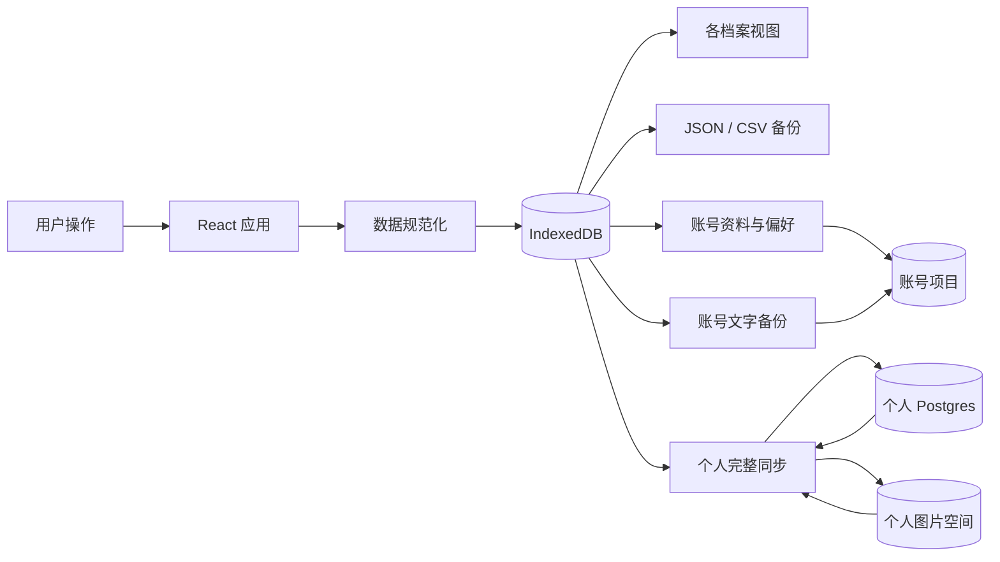

# 实现架构

本文说明回响册的数据流、模块边界和扩展方式，方便复现、审查和继续开发。

## 设计原则

1. **设备数据优先落盘**：新增和编辑先写当前浏览器，不因网络状态阻塞核心操作。
2. **图片优先**：海报、票根、座位图和现场照片是独立媒体资产，不只是一个封面 URL。
3. **数据可带走**：JSON 是完整备份出口，CSV 是便于分析的元数据出口。
4. **前端不持有服务端密钥**：浏览器只使用 anon/publishable key，授权交给 RLS。
5. **共享应用、隔离数据**：GitHub Pages 只共享前端壳，账号数据按用户 ID 隔离，个人档案按同步钥匙隔离。
6. **展示层可替换**：Web、小程序或未来桌面端复用同一份领域模型和云端 schema。

## 运行时数据流

应用启动时先读取 `echo-archive-v2`。如果当前库为空且尚未迁移，会读取旧 IndexedDB `echo-archive-local/events`，再尝试旧 localStorage 数据；两者都没有时才载入 3 条泛化演示档案。

## 核心模型

`EventRecord` 是演出聚合根，包含：

- 标题、类型、状态、日期和时间。
- 城市、场馆、地址与坐标预留。
- 多艺人 `artists` 与带角色的 `lineup`。
- 实付票价、公开票价区间、座位、同行人、标签、曲目和备注。
- 来源渠道、来源链接和导入置信度。
- 多个 `MediaAsset`。

`MediaAsset.kind` 区分 `poster`、`ticket`、`seatMap`、`livePhoto` 和其他附件。它同时保存宽高、MIME、大小、来源和云端路径，使展示层可以按真实比例布局。

## 模块职责

| 文件 | 职责 |
| --- | --- |
| `src/domain.ts` | 领域类型、默认设置、日期与规范化工具 |
| `src/storage.ts` | IndexedDB CRUD、localStorage 降级、旧版迁移 |
| `src/media.ts` | 浏览器图片压缩、data URL/Blob 转换与下载 |
| `src/importers.ts` | 公开链接和文本解析，输出可编辑 `ImportDraft` |
| `src/supabase.ts` | 账号登录、文字备份、个人云端同步、图片上传与签名链接 |
| `src/storageProviders.ts` | 对象存储抽象与后续供应商扩展点 |
| `src/App.tsx` | 路由状态、筛选、各视图、详情、编辑和设置 |
| `src/styles.css` | 设计 token、组件状态和响应式规则 |

## 同步语义

- **账号资料恢复**：登录后读取 `echo_user_profiles`，恢复昵称头像、显示偏好、地图设置和个人 Supabase 公开连接配置。
- **账号文字备份**：移除媒体数组后写入 `echo_text_backups`，可手动或定时执行。
- **文字恢复**：按 `updatedAt` 合并云端与本地记录，本地图片始终保留。
- **完整上传**：使用个人云端同步钥匙写入记录；按设置决定是否上传 data URL 图片，再 upsert 媒体索引。
- **完整恢复**：开启图片同步时恢复签名图片；关闭时只合并文字。
- **删除同步**：回收站记录通过 `deletedAt/deleted_at` 同步，永久删除会清理个人项目记录和图片目录。

## 对象存储扩展

`MediaStorageProvider` 约定 `upload`、`signedUrl` 与 `remove`。接入 Cloudflare R2、腾讯云 COS、阿里云 OSS 或 S3 兼容服务时，推荐由可信服务端签发短期上传凭证，不要把 Secret Key 放进浏览器。

## PWA 与更新

Service Worker 对页面导航采用 network-first，优先获得新版 HTML；对同源静态资源采用 stale-while-revalidate；离线时回退到缓存的应用壳。每次改变缓存策略时应提升 `CACHE_NAME`。

## 后续增强

- 将 `App.tsx` 继续拆分为 `views/`、`components/` 和 `features/`。
- 增加 Playwright 关键流程回归测试。
- 增加媒体哈希去重、缩略图与可恢复上传队列。
- 增加增量同步队列和字段级冲突解决。
- 实装高德/百度适配器，并确保 Key、域名白名单和隐私提示正确。
